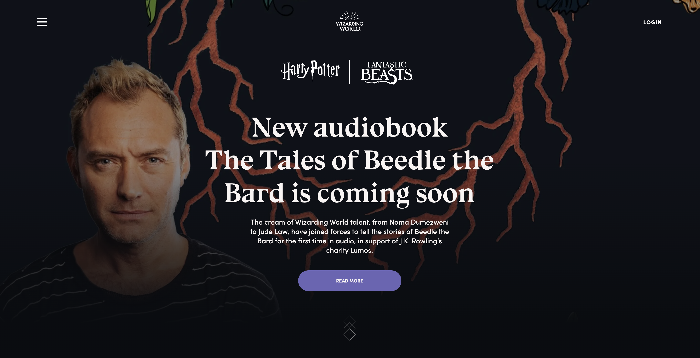

### 프로젝트 소개 : Harry Potter Website 클론\_frontend

- 영화 해리포터의 작가 J.K. 롤링이 만든([해리포터 공식 웹사이트](https://www.wizardingworld.com/)) 클론코딩 했습니다.
- 2개월차 wecode 6기 수강생들의 클론코딩 프로젝트입니다.
- 개발기간 : 2주 (2020.03.09-2020.03.20)
- 인원 : 프론트엔드 3명 & 백엔드 2명  
  ([Backend Repositoty 주소](https://github.com/wecode-bootcamp-korea/wezard-backend))

---

### 목표

- 실제 백엔드 API를 통해 원하는 데이터 가져와서 원하는 서비스 구현하기
- Styled-Component를 사용하여 스타일 적용하기
- 무한스크롤, 이미지 슬라이더, 동적라우터 구현하기

---

### 사용된 기술

Frontend : **ReactJS, Styled-Component, Google Social Login**  
Backend : **Python, Django Web Framework, MySQL, AWS EC2, RDS, Docker, CORS headers**  
Deployment : **AWS**

---

### 구현 기능

1. fetch post를 사용하여 아이디 중복검사 및 비밀번호 유효성 검사
2. 구글 소셜로그인 구현
3. 로그인 시 header 아이콘 및 passport 페이지 정보 변경
4. nav바에 햄버거 메뉴 에니메이션 구현
5. 메인페이지에 스크롤 이벤트를 사용하여 애니메이션 적용
6. 뉴스 & 퀴즈 페이지 무한스크롤 구현
7. fetch를 통해 데이터를 가져와서 퀴즈페이지 문제 및 정답확인 구현
8. fetch를 통해 데이터를 가져와서 sorting(기숙사배정) 페이지 선택지 구현
9. 선택한 값에 따라 기숙사를 배정받고 passport 페이지 배경화면 변경

---

### 데모영상

